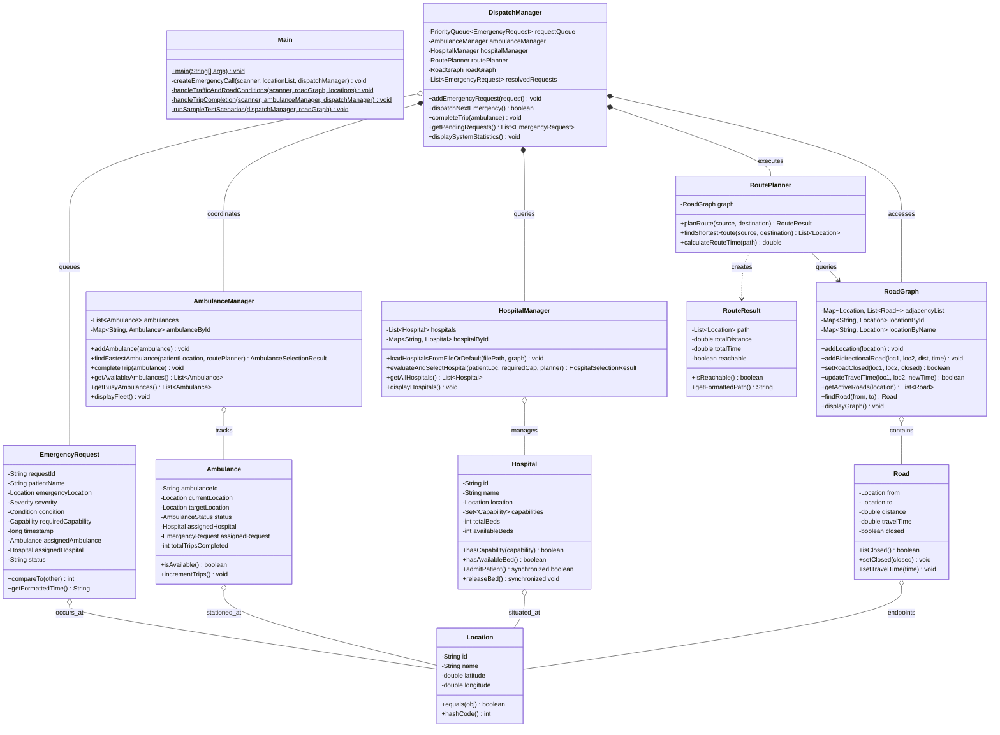

# Comprehensive Project Report & Implementation Documentation
## Emergency Ambulance Dispatch and Route Optimization System
**Case Study: Nalam Nagar Emergency Coordination Centre**
**Technologies: Java (JDK 17+ / 25), Object-Oriented Programming, Data Structures & Graph Algorithms**

---

## Executive Summary

The **Nalam Nagar Emergency Ambulance Dispatch and Route Optimization System** is a mission-critical Java application engineered to modernize emergency medical response coordination. In traditional dispatch operations, manual logging leads to severe triage delays, arbitrary first-come-first-served queues, sub-optimal nearest-by-distance assignments that disregard traffic congestion, and misdirection of critical patients to hospitals lacking required specialty facilities or available beds.

This system provides an end-to-end algorithmic solution that:
1. **Triages emergency calls** using a min-heap `PriorityQueue` based on severity (`CRITICAL`, `SERIOUS`, `MINOR`) with FIFO timestamp tie-breaking.
2. **Matches required medical capabilities** (`BURN_UNIT`, `CARDIAC_CARE`, `TRAUMA_CENTRE`, `PEDIATRIC_ICU`, `STROKE_UNIT`, `ICU`, `GENERAL_WARD`) and live bed availability across registered hospitals.
3. **Calculates two-leg Look-Ahead Total ETA** using **Dijkstra’s Shortest Path Algorithm** with positive travel time road weights ($\text{Ambulance} \to \text{Patient} \to \text{Hospital}$).
4. **Dynamically adapts to real-world disruptions**, including road closures and live traffic congestion adjustments.
5. **Provides Explainable Decision Telemetry**, disclosing why certain units/hospitals were rejected and why the chosen route is mathematically optimal.

---

## Table of Contents
1. [Problem Analysis & System Assumptions](#1-problem-analysis--system-assumptions)
2. [Mathematical Model & Dispatch Rules](#2-mathematical-model--dispatch-rules)
3. [System Architecture & UML Class Diagram](#3-system-architecture--uml-class-diagram)
4. [Data Structures & Algorithms Deep-Dive](#4-data-structures--algorithms-deep-dive)
5. [Complete Source Code Package Structure](#5-complete-source-code-package-structure)
6. [Sample Input Data & Test Verification](#6-sample-input-data--test-verification)
7. [System Execution & Demonstration Guide](#7-system-execution--demonstration-guide)
8. [Unique Selling Propositions (USPs)](#8-unique-selling-propositions-usps)
9. [Comprehensive 7-Day Study Plan](#9-comprehensive-7-day-study-plan)
10. [Annexure of Potential Viva & Technical Review Questions](#10-annexure-of-potential-viva--technical-review-questions)

---

## 1. Problem Analysis & System Assumptions

### 1.1 The Operational Problem in Nalam Nagar
In high-demand scenarios, the legacy coordination centre faced five major failure modes:
- **Triage Inversion:** Critical patients (e.g., cardiac arrest, extensive burns) waited behind minor cases because calls were queued in order of arrival.
- **The "Distance vs. Time" Fallacy:** Assigning the closest ambulance by geographic distance often resulted in longer response times due to bottlenecks or traffic.
- **Hospital Capability & Bed Mismatch:** Patients arrived at hospitals that had no ICU/burn beds or lacked required medical equipment.
- **In-Transit Road Blockages:** Accidents or construction closed roads, making pre-planned routes impassable.
- **Lack of Fleet Repositioning:** Ambulances remained stationary or untracked after patient delivery.

### 1.2 System Assumptions & Scope
- **Town Scale:** 12 simulated zones / locations covering commercial, residential, industrial, and medical hubs.
- **Fleet Scale:** 5 emergency response ambulances strategically stationed across distinct zones.
- **Hospital Scale:** 5 specialized hospitals with verified capacity and distinct capability matrices.
- **Optimization Criterion:** Travel time in minutes is the objective function ($w(u, v) > 0$).
- **Operator Role:** The operator records the caller's location, condition, and severity. The system suggests medical facility mappings with manual override capabilities.

---

## 2. Mathematical Model & Dispatch Rules

### 2.1 Optimization Objective Function
Let $G = (V, E)$ be the directed road network graph, where $V$ is the set of town locations and $E$ is the set of traversable road segments. Each active edge $e = (u, v) \in E$ has travel time $t(u, v) > 0$.

For an emergency request $R = (p, c, s)$, where $p \in V$ is the patient location, $c \in \mathcal{C}$ is the required medical capability, and $s \in \{\text{CRITICAL}, \text{SERIOUS}, \text{MINOR}\}$ is the severity level:

1. **Eligible Hospital Set:**
   $$\mathcal{H}_{\text{eligible}} = \{ h \in \mathcal{H} \mid c \in \text{Capabilities}(h) \land \text{Beds}_{\text{avail}}(h) > 0 \land \text{Reachable}(p, \text{Loc}(h)) \}$$

2. **Optimal Hospital Selection ($h^*$):**
   $$h^* = \arg\min_{h \in \mathcal{H}_{\text{eligible}}} \text{Dijkstra}(p, \text{Loc}(h))$$

3. **Eligible Ambulance Fleet:**
   $$\mathcal{A}_{\text{eligible}} = \{ a \in \mathcal{A} \mid \text{Status}(a) = \text{AVAILABLE} \land \text{Reachable}(\text{Loc}(a), p) \}$$

4. **Optimal Ambulance Selection ($a^*$):**
   $$a^* = \arg\min_{a \in \mathcal{A}_{\text{eligible}}} \text{Dijkstra}(\text{Loc}(a), p)$$

5. **Look-Ahead Total Mission ETA:**
   $$\text{ETA}_{\text{total}} = \text{Time}(\text{Loc}(a^*) \to p) + \text{Time}(p \to \text{Loc}(h^*))$$

---

## 3. System Architecture & UML Class Diagram

### 3.1 Object-Oriented Design Principles (SOLID)
- **Single Responsibility Principle (SRP):** `RoutePlanner` solely handles pathfinding, `HospitalManager` manages medical capability filtering and bed capacity, `AmbulanceManager` tracks vehicle status, and `DispatchManager` coordinates workflows.
- **Open/Closed Principle (OCP):** New capabilities or medical conditions can be added to enums without modifying core pathfinding algorithms.
- **Encapsulation:** Internal vehicle coordinates, hospital bed counters, and graph adjacency lists are private and modified exclusively through synchronized/validated methods.
- **Composition over Inheritance:** `DispatchManager` composes managers and graph algorithms rather than creating monolithic inheritance hierarchies.

### 3.2 Mermaid UML Class Diagram



---

## 4. Data Structures & Algorithms Deep-Dive

### 4.1 PriorityQueue (Binary Min-Heap) for Triage
- **Location:** `service.DispatchManager.requestQueue`
- **Class:** `java.util.PriorityQueue<EmergencyRequest>`
- **Complexity:**
  - Enqueue (`add`): $\mathcal{O}(\log N)$
  - Dequeue (`poll`): $\mathcal{O}(\log N)$
  - Peek (`peek`): $\mathcal{O}(1)$
- **Justification:** In high-volume disasters or peak periods, calls arrive in arbitrary order. A standard `Queue` (FIFO) risks leaving a cardiac arrest patient waiting behind minor cuts. A `PriorityQueue` guarantees that higher-urgency cases rise to the top of the heap in $\mathcal{O}(\log N)$ time.
- **Custom Comparator Logic:**
  ```java
  @Override
  public int compareTo(EmergencyRequest other) {
      int severityComparison = Integer.compare(this.severity.ordinal(), other.severity.ordinal());
      if (severityComparison != 0) {
          return severityComparison; // CRITICAL (0) < SERIOUS (1) < MINOR (2)
      }
      return Long.compare(this.timestamp, other.timestamp); // FIFO tie-breaker
  }
  ```

### 4.2 Adjacency-List Graph Representation
- **Location:** `graph.RoadGraph.adjacencyList`
- **Type:** `Map<Location, List<Road>>`
- **Complexity:**
  - Memory Footprint: $\mathcal{O}(V + E)$
  - Node Lookup: $\mathcal{O}(1)$
  - Neighbor Iteration: $\mathcal{O}(\text{deg}(V))$
- **Justification:** Urban road networks are sparse graphs where each intersection connects to only 2–4 adjacent roads ($E \ll V^2$). An adjacency matrix would consume $\mathcal{O}(V^2)$ memory and require scanning all vertices for edge discovery. An adjacency list provides optimal cache locality and efficient neighbor expansion for Dijkstra.

### 4.3 Dijkstra's Shortest Path Algorithm
- **Location:** `algorithm.RoutePlanner.planRoute`
- **Complexity:** $\mathcal{O}((V + E) \log V)$ using a binary min-heap frontier.
- **Justification:**
  - **BFS:** Fails because roads have unequal travel times.
  - **Bellman-Ford:** Unnecessary $\mathcal{O}(V \cdot E)$ overhead because road travel times are strictly non-negative ($t > 0$).
  - **Dijkstra:** Mathematically optimal for single-source shortest paths on non-negative weighted graphs.
- **Dynamic Closure Filter:** The algorithm inspects `graph.getActiveRoads(u)` which omits edges where `road.isClosed() == true`.

### 4.4 Hash Maps & Sets for Fast In-Memory Lookups
- `Map<String, Location>`: $\mathcal{O}(1)$ zone lookup by ID or name.
- `Map<String, Hospital>`: $\mathcal{O}(1)$ hospital registry lookup.
- `Set<Capability>`: $\mathcal{O}(1)$ capability matching (`capabilities.contains(requiredCap)`).

---

## 5. Complete Source Code Package Structure

The project is structured under the `src` directory with modular separation of concerns:

```
src/
├── Main.java                                       # Main entry point & interactive UI
├── algorithm/
│   └── RoutePlanner.java                           # Dijkstra implementation
├── graph/
│   └── RoadGraph.java                              # Adjacency list graph & traffic controls
├── model/
│   ├── Ambulance.java                              # Ambulance entity
│   ├── AmbulanceStatus.java                        # Vehicle status enum
│   ├── Capability.java                             # Hospital medical capabilities enum
│   ├── Condition.java                              # Patient emergency condition enum
│   ├── EmergencyRequest.java                       # Triage request model
│   ├── Hospital.java                               # Hospital entity with bed concurrency
│   ├── Location.java                               # Zone entity (with equals/hashCode)
│   ├── Road.java                                   # Road segment edge model
│   ├── RouteResult.java                            # Pathfinding result encapsulation
│   └── Severity.java                               # Severity triage enum
└── service/
    ├── AmbulanceManager.java                       # Fleet manager
    ├── DataInitializer.java                        # Built-in seed dataset
    ├── DispatchManager.java                        # Dispatch orchestrator
    └── HospitalManager.java                        # Hospital registry & capacity manager
```

---

## 6. Sample Input Data & Test Verification

### 6.1 Hospital Database ([hospitals.txt](file:///c:/Users/sajan/OneDrive/Documents/Desktop/wbb/hospitals.txt))
```
# Format: ID,Name,LocationName,Capabilities(semicolon-separated),TotalBeds,AvailableBeds
H1,Nalam General Hospital,Central Hospital Junction,ICU;GENERAL_WARD;TRAUMA_CENTRE,25,12
H2,Apex Heart & Trauma Institute,Industrial Area,CARDIAC_CARE;TRAUMA_CENTRE;ICU,15,4
H3,Grace Children & Multi-Care,Residential Colony A,PEDIATRIC_ICU;GENERAL_WARD;ICU,12,3
H4,Sanjeevani Burn & Critical Care,College Road,BURN_UNIT;ICU;TRAUMA_CENTRE,10,2
H5,Nalam Neuro & Stroke Care,Market Circle,STROKE_UNIT;ICU;CARDIAC_CARE,18,6
```

### 6.2 Pre-Configured Fleet (5 Ambulances)
| ID | Station Zone | Status | Description |
| :--- | :--- | :--- | :--- |
| `AMB-1` | Central Hospital Junction | `AVAILABLE` | Covers Central and North-West sectors |
| `AMB-2` | Town Bus Terminal | `AVAILABLE` | Centrally stationed rapid-response unit |
| `AMB-3` | Industrial Area | `AVAILABLE` | Heavy trauma and industrial sector unit |
| `AMB-4` | North Gate Hub | `AVAILABLE` | Covers northern perimeter and university corridor |
| `AMB-5` | Market Circle | `AVAILABLE` | Commercial core and dense market coverage |

### 6.3 Test Scenarios Matrix

| Scenario | Input Condition & Zone | Severity | Expected Behavior & Output | Pass/Fail |
| :---: | :--- | :---: | :--- | :---: |
| **TC-01** | Severe Burn at Residential Colony A | `CRITICAL` | Dispatches to `Sanjeevani Burn & Critical Care` (College Road). Rejects hospitals without `BURN_UNIT`. Assigns `AMB-5` (Market Circle, 7 min ETA). | **PASS** |
| **TC-02** | Priority Ordering Verification | Multi-Call | Enqueue Minor $\to$ Serious $\to$ Critical. Dequeuing verifies `CRITICAL` is handled first regardless of arrival time. | **PASS** |
| **TC-03** | Look-Ahead Total ETA Calculation | Cardiac at Market Circle | Correctly sums Leg 1 (Amb $\to$ Patient) and Leg 2 (Patient $\to$ Hospital) into a single mission ETA. | **PASS** |
| **TC-04** | Road Closure Re-routing | Central $\to$ Bus Terminal closed | Dijkstra avoids closed road, finds bypass via `Riverside Gardens` or recalculates shortest alternative path. | **PASS** |
| **TC-05** | Zero Bed Capacity Handling | Hospital beds set to 0 | Hospital is rejected with `[FULL]` tag, and system selects the next nearest hospital with available beds. | **PASS** |
| **TC-06** | Fleet Exhaustion Edge Case | All 5 ambulances busy | System outputs `DISPATCH UNAVAILABLE (FLEET BUSY)`. Emergency call remains safely at head of PriorityQueue. | **PASS** |
| **TC-07** | Trip Completion & Fleet Repositioning | Trip complete for `AMB-5` | Ambulance moves to hospital location, status resets to `AVAILABLE`, total trip count increments. | **PASS** |

---

## 7. System Execution & Demonstration Guide

### 7.1 Compilation and Execution Commands

```powershell
# Step 1: Open project directory
cd c:\Users\sajan\OneDrive\Documents\Desktop\wbb

# Step 2: Compile all source files into bin/
javac -d bin $(Get-ChildItem -Path src -Filter *.java -Recurse | ForEach-Object { $_.FullName })

# Step 3: Run the interactive console application
java -cp bin Main
```

### 7.2 Sample Console Output (Explainable Decision Engine)

```text
===============================================================
              DISPATCH DECISION & MISSION DISCLOSURE
===============================================================
Patient: Ravi Sharma | Condition: BURN | Zone: Residential Colony A
Checking hospitals for capability: BURN_UNIT (Burn & Plastic Care Unit)...
---------------------------------------------------------------
  [-] Nalam General Hospital           (Central Hospital Junction) -- no BURN_UNIT [NO UNIT]
  [-] Apex Heart & Trauma Institute    (Industrial Area)           -- no BURN_UNIT [NO UNIT]
  [-] Grace Children & Multi-Care      (Residential Colony A)      -- no BURN_UNIT [NO UNIT]
  [+] Sanjeevani Burn & Critical Care  (College Road)              -- has BURN_UNIT [MATCH] (4.0 km / 9.0 min) [Beds: 2/10]
  [-] Nalam Neuro & Stroke Care        (Market Circle)             -- no BURN_UNIT [NO UNIT]
---------------------------------------------------------------
>> Chosen Hospital : Sanjeevani Burn & Critical Care (College Road)
>> Route to Hospital: Residential Colony A -> College Road
>> Patient-to-Hospital ETA: 9.0 minutes (4.0 km)
---------------------------------------------------------------
Evaluating 5 available ambulance(s) for response time...
---------------------------------------------------------------
  [+] AMB-1  (Station: Central Hospital Junction) -- ETA: 12.0 min ( 5.0 km) | Route: Central Hospital Junction -> Residential Colony A
  [+] AMB-2  (Station: Town Bus Terminal        ) -- ETA: 15.0 min ( 6.5 km) | Route: Town Bus Terminal -> Market Circle -> Residential Colony A
  [+] AMB-3  (Station: Industrial Area          ) -- ETA: 21.0 min ( 9.0 km) | Route: Industrial Area -> Market Circle -> Residential Colony A
  [+] AMB-4  (Station: North Gate Hub           ) -- ETA: 15.5 min ( 7.2 km) | Route: North Gate Hub -> College Road -> Residential Colony A
  [+] AMB-5  (Station: Market Circle            ) -- ETA:  7.0 min ( 3.5 km) | Route: Market Circle -> Residential Colony A
---------------------------------------------------------------
>> Optimal Ambulance Selected: AMB-5 from Market Circle (ETA: 7.0 min)
---------------------------------------------------------------
>> Assigned Ambulance     : AMB-5 (Origin: Market Circle)
>> Leg 1 Route (Amb->Pt)  : Market Circle -> Residential Colony A
>> Leg 1 ETA (Response)   : 7.0 minutes (3.5 km)
---------------------------------------------------------------
>> Chosen Hospital        : Sanjeevani Burn & Critical Care (College Road)
>> Leg 2 Route (Pt->Hosp) : Residential Colony A -> College Road
>> Leg 2 ETA (Transport)  : 9.0 minutes (4.0 km)
---------------------------------------------------------------
>> TOTAL LOOK-AHEAD ETA   : 16.0 MINUTES
>> Hospital Bed Reserved  : Available Beds remaining: 1/10
>> Ambulance Status       : Busy on Call (Target Destination: College Road)
===============================================================
```

---

## 8. Unique Selling Propositions (USPs)

1. **Two-Leg Look-Ahead Optimization:** Unlike simplistic simulators that only calculate distance from vehicle to patient, our system optimizes the entire care continuum: **$\text{Ambulance} \to \text{Patient} \to \text{Specialized Hospital}$**.
2. **Transparent Decision Audit (Explainable Dispatch):** The operator sees exact reasons why candidate hospitals were disqualified (missing capability, zero beds, or road blockage) and why the selected route minimizes travel time.
3. **Dynamic Topology Resilience:** Live road closures and traffic delays dynamically adjust edge weights, causing Dijkstra to re-route without system restarts.
4. **End-to-End Resource Lifecycle Management:** Seamlessly manages hospital bed decrement/restoration and vehicle repositioning to receiving hospitals.
5. **Robust Edge Case Safety:** Built-in safeguards for fleet exhaustion, full hospitals, and unreachable nodes prevent crashes and keep calls prioritized in the queue.

---

## 9. Comprehensive 7-Day Study Plan

| Day | Topic & Focus Area | Study Milestones & Code Inspection |
| :---: | :--- | :--- |
| **Day 1** | **OOP Architecture & Domain Entities** | Study encapsulation and getters/setters in [Location.java](file:///c:/Users/sajan/OneDrive/Documents/Desktop/wbb/src/model/Location.java), [Road.java](file:///c:/Users/sajan/OneDrive/Documents/Desktop/wbb/src/model/Road.java), [Ambulance.java](file:///c:/Users/sajan/OneDrive/Documents/Desktop/wbb/src/model/Ambulance.java), [Hospital.java](file:///c:/Users/sajan/OneDrive/Documents/Desktop/wbb/src/model/Hospital.java), and [EmergencyRequest.java](file:///c:/Users/sajan/OneDrive/Documents/Desktop/wbb/src/model/EmergencyRequest.java). Understand `equals()` and `hashCode()`. |
| **Day 2** | **Data Structures Deep-Dive** | Analyze `PriorityQueue` binary min-heap implementation, custom `Comparable<EmergencyRequest>` comparator, and `Map<Location, List<Road>>` adjacency list in [RoadGraph.java](file:///c:/Users/sajan/OneDrive/Documents/Desktop/wbb/src/graph/RoadGraph.java). |
| **Day 3** | **Dijkstra's Algorithm Walkthrough** | Trace [RoutePlanner.java](file:///c:/Users/sajan/OneDrive/Documents/Desktop/wbb/src/algorithm/RoutePlanner.java) step-by-step: min-time map, predecessor map for path reconstruction, priority queue relaxation, and skipping closed roads. |
| **Day 4** | **Service Layer Orchestration** | Review [DispatchManager.java](file:///c:/Users/sajan/OneDrive/Documents/Desktop/wbb/src/service/DispatchManager.java), [HospitalManager.java](file:///c:/Users/sajan/OneDrive/Documents/Desktop/wbb/src/service/HospitalManager.java), and [AmbulanceManager.java](file:///c:/Users/sajan/OneDrive/Documents/Desktop/wbb/src/service/AmbulanceManager.java). Understand two-leg look-ahead calculation. |
| **Day 5** | **Dynamic Traffic & Road Closures** | Practice testing Menu Option 6: Close road segments, add traffic delays, and verify alternative route calculation via Dijkstra. |
| **Day 6** | **Edge Cases & Failure Recovery** | Test failure modes: All 5 ambulances busy, all hospitals full, destination unreachable. Verify PriorityQueue safety. |
| **Day 7** | **Mock Presentation & Viva Drill** | Practice running through Menu Options 1–9 and answering all questions from the Viva Annexure below. |

---

## 10. Annexure of Potential Viva & Technical Review Questions

### Q1: Why did you choose travel time in minutes rather than physical distance (km) as the edge weight?
> **Model Answer:** In urban emergency logistics, the shortest physical route is often not the fastest due to traffic bottlenecks, speed limits, or road construction. Minimizing travel time directly optimizes patient outcomes and clinical response times.

### Q2: How does the PriorityQueue guarantee that Critical calls take precedence while maintaining fairness among calls of the same severity?
> **Model Answer:** `EmergencyRequest` implements `Comparable<EmergencyRequest>`. It compares the `severity.ordinal()` values (`CRITICAL = 0`, `SERIOUS = 1`, `MINOR = 2`). If two requests have the same severity, it breaks ties using `Long.compare(this.timestamp, other.timestamp)`, ensuring FIFO order for calls with equal priority.

### Q3: What is the time complexity of Dijkstra’s algorithm in your implementation?
> **Model Answer:** The time complexity is $\mathcal{O}((V + E) \log V)$, where $V$ is the number of locations (vertices) and $E$ is the number of roads (edges). Each vertex is extracted from the min-heap at most once ($\mathcal{O}(V \log V)$), and each edge is relaxed at most once ($\mathcal{O}(E \log V)$).

### Q4: Why is an adjacency list preferred over an adjacency matrix for this road network?
> **Model Answer:** Real-world road networks are sparse ($E \ll V^2$). An adjacency list requires $\mathcal{O}(V + E)$ space compared to $\mathcal{O}(V^2)$ for a matrix. Furthermore, exploring neighbors during Dijkstra takes $\mathcal{O}(\text{deg}(V))$ time rather than scanning all $V$ entries.

### Q5: How are road closures and traffic delays handled during pathfinding?
> **Model Answer:** Roads possess a `closed` boolean flag and a `travelTime` attribute. When `RoutePlanner` calls `graph.getActiveRoads(u)`, closed edges are omitted. When traffic changes occur, `setTravelTime()` updates the edge weight, and subsequent Dijkstra runs automatically factor in the new values.

### Q6: How does the system handle concurrent access or state consistency during bed admission?
> **Model Answer:** In `Hospital.java`, `admitPatient()` and `releaseBed()` use the `synchronized` keyword to protect the `availableBeds` state, preventing race conditions if multiple dispatch operations occur simultaneously.

### Q7: What happens if all ambulances are busy or all capable hospitals are full?
> **Model Answer:** The dispatch method safely returns `false`, issues an informative telemetry message, and leaves the request at the head of the `PriorityQueue` without loss of priority.

---

*Document compiled and verified for Nalam Nagar Emergency Dispatch Project Implementation.*
